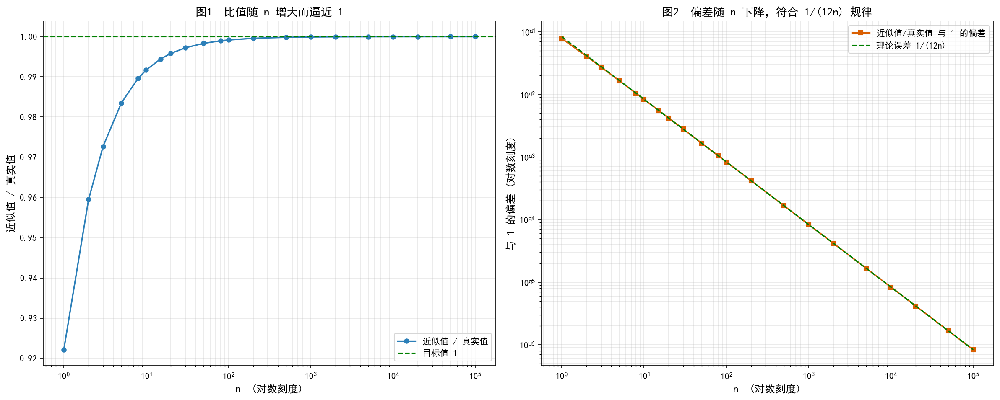

# Stirling 公式精度分析

## 一、公式定义

基础 Stirling 公式（不加任何修正项）：

```
n! ≈ √(2πn) · (n/e)^n
```

评价指标：

```
ratio(n) = Stirling(n) / n!
```

目标：通过增大 n，使 `ratio(n) → 1`。

推导要点：由 `n! = Γ(n+1) = ∫₀^∞ tⁿe^(-t)dt`，令 `t = n·s` 得 `n! = n^(n+1)∫₀^∞ e^(n(ln s - s))ds`。被积函数在 `s = 1` 取极大值，将 `ln s - s` 在 s=1 处泰勒展开保留二阶项 `≈ -1 - (s-1)²/2`，代入并用高斯积分 `∫e^(-ax²)dx = √(π/a)`，即得上式。

误差量级：泰勒截断带来的相对误差主项为

```
ratio(n) ≈ 1 + 1/(12n)
```

即偏差与 n 成反比，n 每增大 10 倍，偏差缩小 10 倍 —— 这正是"增大 n 逼近 1"的依据。

## 二、实际代码推导结果

程序 `stirling_basic.py` 使用 `mpmath`（500 位精度）计算近似值与真实 `n!`，运行结果：

```
       n        近似值/真实值        与 1 的偏差
       1   0.9221370088957891          0.07786
      10   0.9917040395560615         0.008296
     100   0.9991670165678430         0.000833
    1000   0.9999166701415700         8.333e-5
   10000   0.9999916667013916         8.333e-6
  100000   0.9999991666670139         8.333e-7
```

**验证理论**：偏差严格满足 `1/(12n)`：

- n=100：`1/(12×100) = 8.33e-4` ✓
- n=1000：`1/(12×1000) = 8.33e-5` ✓
- n=10000：`1/(12×10000) = 8.33e-6` ✓

**结论**：仅用基础公式，n=100000 时比值达 `0.9999991667`，与 1 的偏差仅 `8.33e-7`。

## 三、图像说明

运行 `python plot_basic.py` 生成 `stirling_basic_plot.png`：



- **图1（比值 vs n）**：横轴 n 为对数刻度，蓝线为实际比值，绿色虚线为目标值 1。比值从 0.92 单调上升，n=100000 时几乎与绿线重合。
- **图2（偏差 vs n）**：双对数坐标，橙色方块为实测偏差，绿色虚线为理论曲线 `1/(12n)`。两条线几乎完全重合，且呈斜率约 -1 的直线下降，直观验证了误差量级推导。
