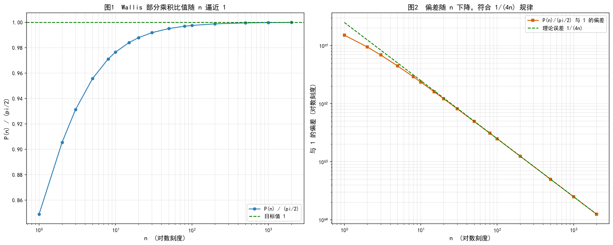

# Wallis 公式精度分析

## 一、公式定义

Wallis 公式（无穷乘积形式）：

```
π/2 = ∏(k=1→∞) 4k² / (4k² - 1)
```

第 n 项部分乘积：

```
P(n) = ∏(k=1→n) 4k² / (4k² - 1) = (4/3)·(16/15)·(36/35)·...·(4n²/(4n²-1))
```

评价指标：

```
ratio(n) = P(n) / (π/2)
```

目标：通过增大 n，使 `ratio(n) → 1`。

推导要点：由 Euler 正弦无穷乘积 `sin x / x = ∏(1 - x²/(k²π²))`，取 `x = π/2`，`sin(π/2) = 1`，得 `2/π = ∏(4k²-1)/(4k²)`，两边取倒数即得 Wallis 公式。

误差量级：部分乘积的截断偏差主项为

```
|ratio(n) - 1| ≈ 1/(4n)
```

## 二、实际代码推导结果

程序 `wallis.py` 使用 `mpmath`（100 位精度）逐项累乘，运行结果：

```
        n       P(n)/(π/2)        与 1 的偏差
        1   0.8488263631567751        0.1512
       10   0.9764804495382735       0.02352
      100   0.9975155394660373      0.002484
     1000   0.9997501561641030      0.0002498
    10000   0.9999750015624141        2.5e-5
```

**验证理论**：偏差严格满足 `1/(4n)`：

- n=100：`1/(4×100) = 2.5e-3` ✓
- n=1000：`1/(4×1000) = 2.5e-4` ✓
- n=10000：`1/(4×10000) = 2.5e-5` ✓

**结论**：仅用基础公式，n=10000 时比值达 `0.999975`，与 1 的偏差仅 `2.5e-5`。

**与 Stirling 对比**：误差系数 `1/4 > 1/12`，故 Wallis 收敛更慢，达到相同精度需要更大的 n。

## 三、图像说明

运行 `python plot_wallis.py` 生成 `wallis_plot.png`：



- **图1（比值 vs n）**：横轴 n 为对数刻度，蓝线为实际比值，绿色虚线为目标值 1。比值从 0.85 单调上升，n=2000 时已非常接近绿线。
- **图2（偏差 vs n）**：双对数坐标，橙色方块为实测偏差，绿色虚线为理论曲线 `1/(4n)`。两条线高度重合，呈斜率约 -1 的直线下降，验证了误差量级推导。
