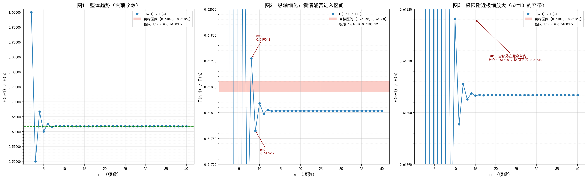

# 斐波那契数列相邻项比值

## 一、公式定义

斐波那契数列：

```
F(1) = 1,  F(2) = 1,  F(n) = F(n-1) + F(n-2)   (n >= 3)
```

考察比值：

```
ratio(n) = F(n-1) / F(n)
```

由 Binet 公式 `F(n) = (φⁿ - ψⁿ)/√5`（`φ = (1+√5)/2`，`ψ = (1-√5)/2`），当 n → ∞ 时 `ψⁿ → 0`，故：

```
lim(n→∞) F(n-1)/F(n) = 1/φ = (√5-1)/2 ≈ 0.6180339887
```

由于 `ψⁿ` 符号随 n 交替，比值在极限两侧**震荡收敛**，幅度指数级衰减。

## 二、实际代码推导结果

程序 `fibonacci_ratio.py` 逐项计算 `F(n-1)/F(n)`，判断是否落入 `[0.61840, 0.61860]`。运行结果：

```
   n            F(n-1)        F(n)      ratio
   7                 8          13     0.6153846154
   8                13          21     0.6190476190
   9                21          34     0.6176470588
  10                34          55     0.6181818182
  11                55          89     0.6179775281
  12                89         144     0.6180555556
  13               144         233     0.6180257511
  ...

在给定范围内没有找到满足条件的项。
```

关键跨越点：

```
n = 8 : 13/21 = 0.6190476190  > 0.61860   （高于上界）
n = 9 : 21/34 = 0.6176470588  < 0.61840   （低于下界）
```

**结论：区间内无解。** 比值在 n=8 与 n=9 之间一步跨过整个区间，此后偏离极限的幅度始终小于 0.00015，而区间下界距极限有 0.00037，永远无法触及。

## 三、图像说明

运行 `python plot_fib_ratio.py` 生成 `fib_ratio_plot.png`：



- **图1（纵轴 0.49~1.01）**：蓝线为比值曲线，红色横带为目标区间，绿色虚线为极限 `1/φ`。整体看曲线快速下探并收敛到 0.618 附近，红带位于曲线上方。
- **图2（纵轴 0.6170~0.6200）**：n=8 冲到 0.61905 高出红带上沿，n=9 跌到 0.61765 低于红带下沿，红带恰好卡在两点之间，曲线**从上方直接跳到下方，未穿过红带**。
- **图3（纵轴 0.61790~0.61820）**：n≥10 后曲线锁在 0.61798~0.61818 的窄带内震荡，最高点仍低于红带下沿 0.61840，两者之间存在明显空白，永不相交。

## 四、补充说明

本问题无需 GPU：递推 `F(n)` 存在强串行依赖，规模仅几十项，且边界判断需要高精度（代码使用 `Decimal`，精度 60 位）。
